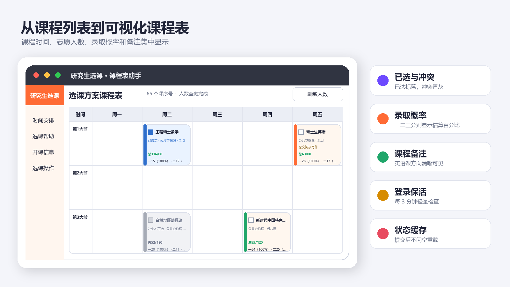
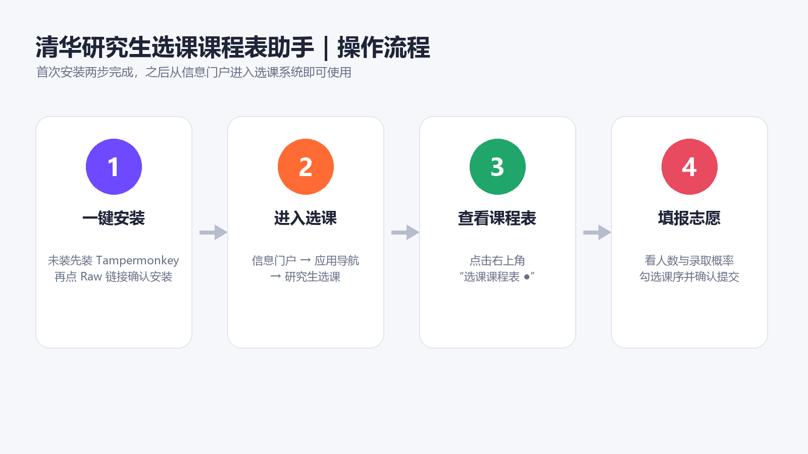

# 清华研究生选课课程表助手

一个用于清华大学研究生选课系统的 Tampermonkey（油猴）脚本。它把原本较难浏览的课程列表整理成按星期和大节排列的课程表，并显示报名总人数、各志愿人数与估算录取概率、课程备注和登录保活状态。

> 仅匹配 `https://zhjwxk.cic.tsinghua.edu.cn/` 下的研究生选课页面；不会把课程或个人信息发送到第三方服务器。

**已经装好 Tampermonkey？[点这里一键安装 / 更新脚本](https://raw.githubusercontent.com/Delthin/thu-graduate-course-helper/main/thu-graduate-course-helper.user.js)** · 当前版本 `0.5.2`

## 界面与操作图示





## 功能

- 将可选课程整理成星期一至星期五、每天六个大节的课程表。
- 在课程卡片中显示课程号、课序号、周次、教师、学分和课程备注。
- 显示报名统计：总人数、第一志愿、第二志愿、第三志愿及优先报名人数，并在每个志愿人数后显示估算录取概率。
- 在课程表中直接勾选课程、设置志愿，并同步到原选课表单。
- 将已选定课程显示为蓝色卡片；与其上课周次重叠的同时间课程会置灰并禁止选择。
- 提交导致原选课页面刷新时，保留已选定课程、已加载人数和筛选设置，并自动保持在课程表界面。
- 选择一个课序后默认隐藏同课程的其他课序，可随时显示备选。
- 支持按课程名、课程号、教师或课程备注搜索。
- 每三分钟发送一次同站轻量请求，降低因页面闲置造成的登录超时概率。
- 提交前再次确认；脚本不会自动提交、退课或删除课程。

## 安装（首次仅两步）

### 1. 安装 Tampermonkey（只需一次）

按浏览器选择：

- **Edge**：[打开 Edge 扩展商店安装 Tampermonkey](https://microsoftedge.microsoft.com/addons/detail/tampermonkey/iikmkjmpaadaobahmlepeloendndfphd)
- **Chrome**：[打开 Chrome 应用商店安装 Tampermonkey](https://chromewebstore.google.com/detail/tampermonkey/dhdgffkkebhmkfjojejmpbldmpobfkfo)

已经安装过 Tampermonkey，可以跳过这一步。

### 2. 一键安装脚本

点击 **[一键安装 / 更新选课助手](https://raw.githubusercontent.com/Delthin/thu-graduate-course-helper/main/thu-graduate-course-helper.user.js)**，在 Tampermonkey 弹出的页面确认安装即可。

安装一次后，Tampermonkey 会根据脚本内的更新地址自动检查新版本，不再需要复制代码或手动覆盖。

如果链接只显示代码而没有安装页面，说明 Tampermonkey 尚未安装、未启用，或没有获得运行用户脚本的权限；处理后重新点击上面的安装链接即可。

## 使用流程

1. 从清华大学信息门户进入“应用导航”。
2. 点击“研究生选课”，不要直接使用已经显示登录超时的旧标签页。
3. 在左侧展开“选课操作”，进入“选课”。
4. 等待页面右上角出现“选课课程表 ●”。
5. 点击该按钮打开课程表。
6. 使用搜索框筛选课程；搜索也会匹配“论文阅读写作”“国际学术交流”等课程备注。
7. 在课程卡片中勾选需要的课序，并选择第一、第二或第三志愿。
8. 检查顶部的已选门数、学分和志愿名额。
9. 确认无误后点击“提交所选”，并在确认框中再次确认。

课程表内还提供：

- **显示同课备选**：显示同一课程的其他课序。
- **显示不可选/深圳班**：显示默认隐藏的受限课程。
- **刷新人数**：重新读取学校发布的报名统计。
- **清空勾选**：只清除当前尚未提交的勾选，不会删除下方已经选定的课程。
- **关闭**：返回原始选课列表。

## 人数与志愿数据说明

课程卡片可能显示：

```text
总116/80
一15（100%） · 二12（100%） · 三81（55%） · 优8（100%）
```

含义如下：

- `总116/80`：当前报名总人数为 116，学校统计页显示的可选容量为 80。
- `一15（100%）`：优先报名录取后，剩余容量足以容纳新增你在内的全部第一志愿。
- `二12（100%）`：第一志愿录取后，剩余容量足以容纳新增你在内的全部第二志愿。
- `三81（55%）`：录取更高志愿后还剩 45 个名额，按你加入后的 82 名第三志愿等概率估算约为 55%。
- `优8（100%）`：优先报名按必中处理。

概率按“优先报名 → 一志愿 → 二志愿 → 三志愿”依次估算：`剩余容量 ÷（当前该志愿人数 + 你）`，最高为 100%。概率字体中，100% 为绿色，0% 为红色，1%–99% 为黄色。

学位课与非学位课报名人数会合并后显示。概率只是假设同一志愿内等概率竞争的当前快照估算，人数继续变化、退选或学校实际录取规则都可能改变结果。

### 为什么有些课程显示 `总—/容量`？

`—` 不应直接理解为 0，常见原因有：

1. **人数仍在加载**：课程卡片会显示“人数加载中”，等待顶部状态变为“人数查询完成”即可。
2. **统计页没有该课程记录**：卡片会显示“暂无统计”。可能确实无人报名，也可能该课程尚未进入本轮统计。
3. **特殊或不可在线选择的课程**：部分定向班、网上不选课课程没有普通志愿统计。
4. **登录状态失效或请求失败**：卡片会显示具体错误；请从信息门户重新进入选课系统后重试。

报名数据来自学校的“填报志愿情况查询”页面；同一课程课序较多时，脚本会自动读取后续统计分页。数据并非每秒更新，页面顶部会显示学校最近一次统计时间，脚本刷新不能让学校提前生成新数据。

## 登录保活状态

“选课课程表”按钮右侧的小圆点表示：

- **绿色**：最近一次保活请求成功。
- **橙色**：保活请求发生网络错误。
- **红色**：服务器已经返回登录超时页面，需要从信息门户重新进入。
- **灰色**：正在进行首次检查。

保活请求每三分钟访问一次选课系统自己的轻量页面，不会提交课程。它可以降低普通闲置超时的概率，但无法绕过服务器的绝对登录期限、统一身份认证过期，或浏览器对标签页的彻底休眠。

## 安全与隐私

- 只访问清华选课系统自身页面。
- 不引入外部脚本、统计服务或网络接口。
- 不保存账号、密码或 Cookie。
- 不会自动提交选课、删除课程或退课。
- 点击“提交所选”后仍会显示确认框。

## 常见问题

### 页面提示“用户登陆超时或访问内容不存在”

保活只能延长仍然有效的会话，不能恢复已经失效的会话。请返回清华信息门户，通过“应用导航 → 研究生选课”重新进入。

### 没有出现“选课课程表”按钮

确认：

1. Tampermonkey 和本脚本均已启用。
2. 当前网址属于 `zhjwxk.cic.tsinghua.edu.cn`。
3. 已进入左侧“选课操作 → 选课”，而不是系统帮助页。
4. 刷新页面后重试。

### 报名人数长时间不更新

先查看课程表顶部是否显示“人数查询完成”，再点击“刷新人数”。如果状态点变红，应先从信息门户重新进入。

## 开发与测试

需要 Node.js。安装依赖并运行检查：

```bash
npm install --include=dev
npm test
```

测试包括：

- 课程时间、单双周和前后八周冲突解析。
- 已选课程识别、冲突置灰及原表单勾选/志愿同步。
- 嵌套表头、后续分页、一二三志愿人数解析及逐志愿概率边界。
- 提交刷新后的已选状态、人数与筛选缓存。
- 登录保活 URL 与过期文本识别。

## 文件结构

```text
thu-graduate-course-helper.user.js  # 油猴脚本
test.cjs                            # 最小单元测试
package.json / package-lock.json    # 测试命令与开发依赖
docs/assets/                        # README 功能与操作图示
README.md                           # 安装和使用说明
LICENSE                             # MIT License
```

## 免责声明

本项目是非官方辅助工具。选课结果、容量、报名人数和志愿规则均以清华大学教务系统实际显示及学校通知为准。提交前请自行核对课程、课序、志愿和时间冲突。

## License

[MIT](./LICENSE)
